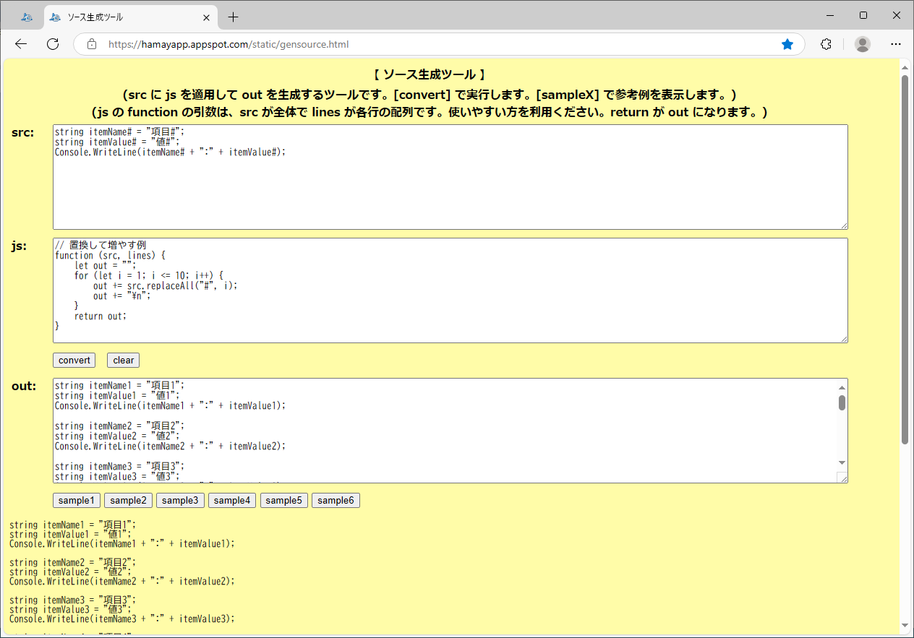

# GenSource

## 概要
- src に js を適用して out を生成する HTML です。

- プログラムの一部を置換しつつ増やすような処理を、  
  手軽に実行することができます。

- 実行例は、以下のページにあります。  
  https://hamayapp.appspot.com/static/gensource.html

## 使い方
- gensource.html を ブラウザで開くと起動します。

- src のテキストボックスにソースコードを貼り付け、js に JavaScript の関数を記述し、  
  convert ボタンをクリックすると、src に js を適用します。  
  結果は、out のテキストボックスに表示されます。  
  (また、その下の空き領域にも表示されます)

- js に記述する JavaScript の関数は、src と lines という 2 個の引数を持ちます。  
  src には、src テキストボックスの内容がそのまま入ります。  
  lines には、src テキストボックスの内容を各行に分割した配列データが入ります。  
  関数の戻り値が、out テキストボックスの内容になります。

- sampleX ボタンをクリックすると、変換の例を表示します。

## 注意事項
1. JavaScript の実行には、iframe の sandbox 機能を使用しています。  
   ただ、まだ何かセキュリティ上の問題があるかもしれません。

## 環境等
- OS
  - Windows 10 (version 22H2) (64bit)
- ブラウザ
  - Edge v133

## 履歴
- 2025-2-11  v1.00 (初版)
- 2025-2-15  v1.01 `<form>`タグを削除
- 2025-2-16  v1.02 不要行を削除

(2025-2-16)
